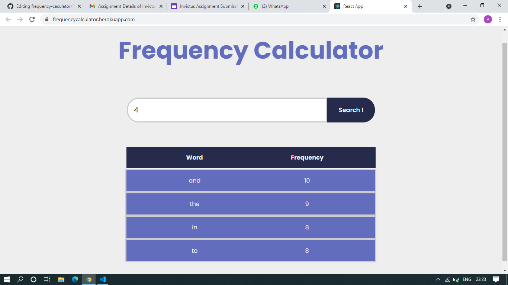
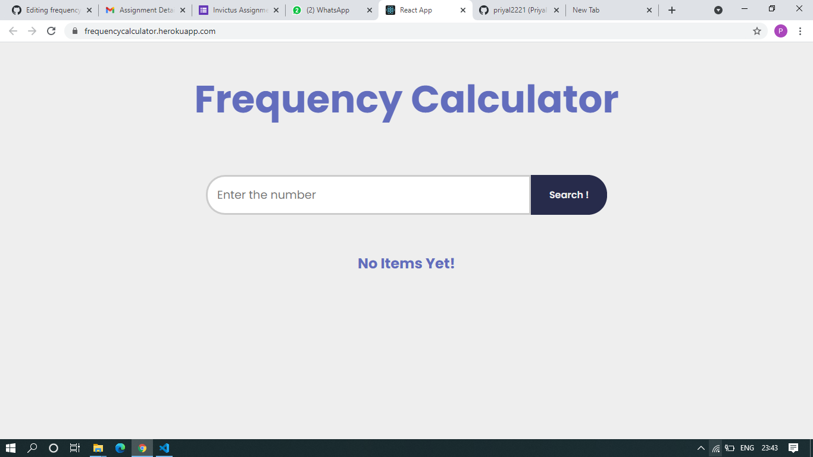
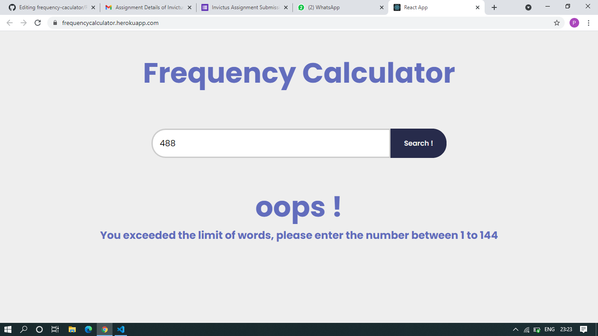

# Code components and a breif description about the code

1. This app has an item component rendering a table row as word with its frequency passed every type as props.
2. In App.js component we have a search bar which fetches API using UseEffect hook . 
3. There are 4 states for input,frequency array,empty, data
4. Frequency of each word is calculated using frequency map where words with no. of times it appear in file is stored if its not present then freq is set to zero else frequency of that word is incremented.
5. Also commas, semicolons , colons i.e some special characters are replaced with space and then that space is deleted from the array,and also the data of file is converted into lowercase so that we can accurate frequency of each word.
6. Search button trigers a Onclick event which sets the current input given at that time.

# DEPLOYED ON HEROKU 

## LINK OF DEPLOYED APP: https://frequencycalculator.herokuapp.com/
    
# Some of the Outputs of the TestCases are as follows:

  TestCase 1.
  
    Initially when no value is entered.
  

    
   TestCase 2.
 
    After entering a value lets say 4
   

    
   TestCase 3.
    
    If we enter value more than the words present in the text file
    

